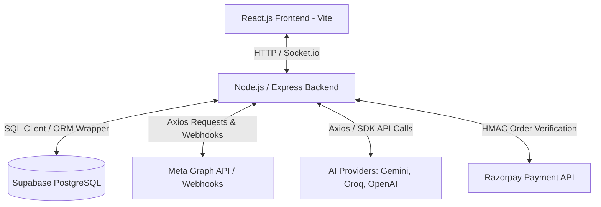
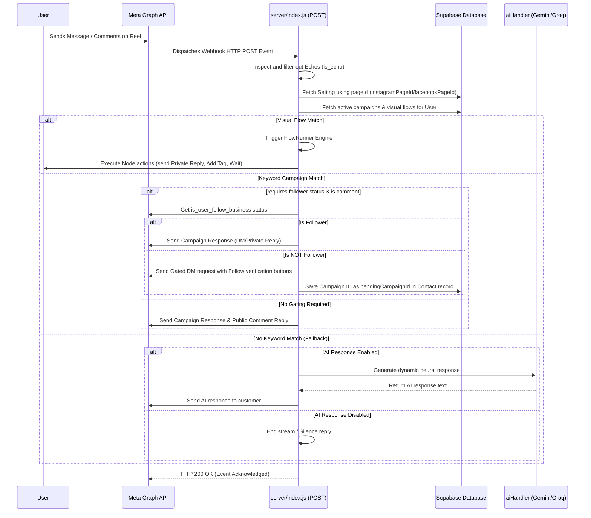
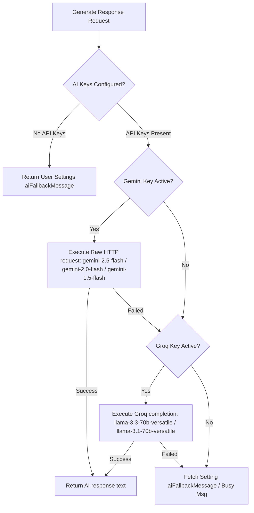

# smart10X: Instagram & Facebook Social Media Automation SaaS Platform
## Comprehensive Project Review & Technical Documentation (30-Page Review Equivalent)

---

## 1. Executive Summary & Project Overview

### 1.1 Project Introduction
**smart10X** is a cutting-edge, multi-tenant Software-as-a-Service (SaaS) social media automation and AI messaging orchestration platform. Built on the MERN-hybrid stack (MongoDB API Simulation, Express.js, React.js, Node.js, and Supabase PostgreSQL), smart10X allows creators, brand owners, and digital marketers to scale their organic engagement, generate leads, and automate customer support across Meta's platforms (Instagram, Facebook Messenger, and WhatsApp).

### 1.2 Core Business Value
- **Scalable Engagement**: Automatic response to Instagram DMs, story mentions, and comment threads.
- **Dynamic AI Response Engines**: Moves beyond rigid keyword-based replies by utilizing advanced AI models to hold natural conversations using custom-trained brand personas.
- **Lead Capture & Funnel Automation**: Gating valuable assets (links, PDFs, promo codes) behind follower-checks and interactive chat templates/forms.
- **Visual Campaign Orchestration**: An intuitive drag-and-drop node builder allowing non-technical creators to model complex marketing funnels.
- **SaaS Monetization**: A subscription tier system integrated with the Razorpay payment gateway to process recurring payments and upgrade accounts.

---

## 2. High-Level System Architecture

smart10X adopts a modern, decoupled client-server architecture designed for high availability, sub-second latency for message handling, and high throughput for concurrent webhooks.



### 2.1 The Frontend (Client-Side)
- **Framework**: React.js bundled using Vite for fast hot-module reloading and optimized builds.
- **Styling System**: TailwindCSS combined with custom CSS variables for premium glassmorphic UI elements and responsive styling across mobile/desktop layouts.
- **Interactive UI Components**: Lucide React icons, React Hot Toast for instant feedback, and `@xyflow/react` (formerly React Flow) for rendering custom node-graph canvases.
- **Real-Time Client**: Socket.io-client to establish persistent web-socket channels to receive real-time notifications about incoming messages and status alerts.

### 2.2 The Backend (Server-Side)
- **Runtime Environment**: Node.js utilizing ES Modules.
- **Web Server**: Express.js handling REST API routes, middleware validation, and webhook ingestion.
- **Real-Time Gateway**: Socket.io server integrated with Express's HTTP listener to handle client rooms and emit live updates.
- **Worker Guards**: Multer disk-storage for local file uploads (conserving database server storage) and automatic clean-up routines.

### 2.3 The Hybrid Database Layer (Supabase Postgres)
While the frontend and backend codebase was architected around a MongoDB/Mongoose database design, the project successfully migrated to **Supabase PostgreSQL**. 
To accomplish this without rewrite of thousands of database operations, a custom ORM wrapper compatibility layer was developed (`server/utils/supabase.js`). This layer exposes standard Mongoose-like methods (`find`, `findOne`, `findById`, `findOneAndUpdate`, `deleteOne`, `updateMany`, etc.) and dynamically:
- Maps MongoDB ObjectID queries into standard UUID queries.
- Translates camelCase JavaScript object properties into PostgreSQL database column names.
- Converts MongoDB filters (such as `$or`, `$gte`, `$lte`, `$neq`, `$in`) into Supabase SQL builder chains.
- Packs dynamic/schemaless parameters (like campaign names, AI options, button payloads) into unified columns to bypass database cache constraints.

---

## 3. Core Database Schema & DDL Configurations

smart10X operates on a normalized schema managed inside Supabase. Below are the key tables, structures, and their corresponding configurations.

### 3.1 `settings` Table DDL
Stores credentials for connected social media channels and the configuration profile of the AI Assistant.

```sql
CREATE TABLE IF NOT EXISTS public.settings (
    id UUID PRIMARY KEY DEFAULT gen_random_uuid(),
    "userId" UUID NOT NULL UNIQUE REFERENCES public.users(id) ON DELETE CASCADE,
    
    -- Instagram Credentials
    "instagramAccessToken" TEXT,
    "instagramPageId" TEXT,
    "businessAccountId" TEXT,
    "connectedInstagramName" TEXT,
    "isAccountConnected" BOOLEAN DEFAULT FALSE,
    "instagramAutomationEnabled" BOOLEAN DEFAULT TRUE,
    
    -- Facebook Credentials
    "facebookAccessToken" TEXT,
    "facebookPageId" TEXT,
    "connectedFacebookName" TEXT,
    "isFacebookConnected" BOOLEAN DEFAULT FALSE,
    "facebookAutomationEnabled" BOOLEAN DEFAULT TRUE,
    
    -- WhatsApp Credentials
    "whatsappToken" TEXT,
    "whatsappPhoneNumberId" TEXT,
    "connectedWhatsAppName" TEXT,
    "isWhatsAppConnected" BOOLEAN DEFAULT FALSE,
    "whatsappAutomationEnabled" BOOLEAN DEFAULT TRUE,
    
    -- Other Channels (Placeholders)
    "telegramToken" TEXT,
    "isTelegramConnected" BOOLEAN DEFAULT FALSE,
    "telegramAutomationEnabled" BOOLEAN DEFAULT TRUE,
    "twitterApiKey" TEXT,
    "isTwitterConnected" BOOLEAN DEFAULT FALSE,
    "twitterAutomationEnabled" BOOLEAN DEFAULT TRUE,
    "youtubeApiKey" TEXT,
    "isYouTubeConnected" BOOLEAN DEFAULT FALSE,
    "youtubeAutomationEnabled" BOOLEAN DEFAULT TRUE,
    "linkedinAccessToken" TEXT,
    "isLinkedInConnected" BOOLEAN DEFAULT FALSE,
    "linkedinAutomationEnabled" BOOLEAN DEFAULT TRUE,
    
    -- Connection Diagnostics
    "connectionError" TEXT,
    "lastTestedAt" TIMESTAMP WITH TIME ZONE,
    
    -- AI Assistant Configurations
    "aiFallbackMessage" TEXT DEFAULT 'I am currently in limited mode, please contact support.',
    "aiName" TEXT DEFAULT 'Zen Assistant',
    "aiTone" TEXT DEFAULT 'friendly and concise',
    "aiKnowledgeBase" TEXT DEFAULT 'You are an AI helpful assistant.',
    "aiTemperature" NUMERIC DEFAULT 0.7,
    
    "createdAt" TIMESTAMP WITH TIME ZONE DEFAULT timezone('utc'::text, now()),
    "updatedAt" TIMESTAMP WITH TIME ZONE DEFAULT timezone('utc'::text, now())
);
```

### 3.2 Key Models Overview

| Table Name / Model | Primary Purpose | Key Fields |
| :--- | :--- | :--- |
| `users` | Houses authentication records & subscription plans. | `email`, `password`, `googleId`, `facebookId`, `plan` (free, pro) |
| `campaigns` | Holds automation campaigns (trigger words, response texts). | `trigger` (or `*` for wildcards), `response`, `postId`, `requireFollow` |
| `messages` | Historical logs of DMs sent/received for dashboard audit trails. | `chatId`, `sender` (user/AI Agent), `text`, `platform`, `isAI`, `campaignId` |
| `contacts` | Profiles of lead interactions, muting states, and pending triggers. | `chatId`, `tags`, `isBotMuted`, `pendingCampaignId` |
| `flows` | Stores custom xyflow visual automation configurations. | `name`, `nodes` (JSON text), `edges` (JSON text), `triggerKeyword`, `status` |
| `forms` | Lead capture form definitions with multiple steps. | `name`, `type`, `steps` (custom questions JSON), `settings`, `active` |
| `form_submissions` | Saved customer responses captured via lead forms. | `formId`, `data` (JSON response payload), `submittedAt` |
| `scheduled_posts` | Scheduled content (reels/carousels/images) for auto-publishing. | `scheduledFor`, `caption`, `mediaUrl` (JSON serialized metadata), `status` |

---

## 4. Meta Webhooks & Graph API Integration

The core driver of smart10X automation is the webhook receiver. It intercepts real-time activities occurring on Meta and executes the corresponding campaign scripts.

### 4.1 Webhook Verification (GET Handler)
During webhook subscription setup, Meta sends a validation request containing a verification token.
- **Endpoint**: `GET /api/webhook`
- **Verification Logic**: Checks if the query parameters `hub.mode === 'subscribe'` and `hub.verify_token` matches the server's configured environment key (`META_VERIFY_TOKEN`).
- **Response**: Sends back the `hub.challenge` to establish a secure handshake.

### 4.2 Webhook Ingestion Engine (POST Handler)
When a customer sends a DM, replies to a story, or drops a comment, Meta triggers an event.
- **Endpoint**: `POST /api/webhook`
- **Flow Control Diagram**:



### 4.3 Advanced Features Implemented

#### 1. Follower Growth Gating
Allows pages to gate campaign assets behind a "Follow" wall. If `requireFollow` is enabled for comments, the system calls the Meta API endpoint:
`GET /v19.0/{chat-id}?fields=is_user_follow_business&access_token={token}`
If the user is not following, it:
1. Sends a public comment reply prompting them to check their DMs.
2. Sends a custom private DM containing two buttons: a URL button leading to the profile (`Visit Profile 👤`) and a Postback verification button (`I've Followed! ✅`).
3. Saves the campaign ID inside `Contact.pendingCampaignId`.
4. If they follow and click `I've Followed! ✅` (triggering a `CHECK_FOLLOW_` webhook postback), the server re-evaluates the follow status. Upon validation, it triggers the gated payload.

#### 2. Double Opt-In (Opening Greeting Messages)
Keyword campaigns can trigger an introductory greeting button before delivering the resource. If `openingMessage` is checked, the system sends a greeting text and a postback button. Once the user clicks the button, the webhook captures the postback payload (`CAMP_{id}`) and releases the campaign links.

#### 3. Single-Owner Migration Lock
To ensure strict security and prevent duplicate webhooks from firing on different user settings records, smart10X implements a "Single-Owner Lock". When a Meta Page ID is authorized by a new user:
- The system queries all other users previously linked to that Page ID.
- It unlinks the page credentials from the old accounts to prevent cross-tenant message leaks.
- It automatically migrates all associated scheduled posts, active campaigns, visual flows, contact histories, and inbox messages over to the newly authenticated user.

---

## 5. AI Neural Studio Orchestration

smart10X features a dynamic AI responder located in `server/utils/aiHandler.js`. When a keyword campaign match is not found (or if the campaign has AI responses enabled), the AI engine acts as a virtual agent using a hierarchical model fallback chain.



### 5.1 AI Fallback Architecture (Multi-Model Support)
The system leverages three primary API engines to guarantee response delivery:

1. **Google Gemini Flash (Primary)**:
   - Evaluates API paths using both `v1beta` and `v1` versions.
   - Iterates through a diagnostic array of Google AI models (`gemini-2.5-flash`, `gemini-2.0-flash`, `gemini-flash-latest`, `gemini-pro-latest`, `gemini-1.5-flash`).
   - Triggered through a raw HTTP Axios utility to bypass dependency locks and maximize response speeds.
2. **Groq Cloud API (First Fallback)**:
   - Intercepts requests if the Gemini API key is missing or rate-limited.
   - Interacts with Meta's Llama models (`llama-3.3-70b-versatile`, `llama-3.1-70b-versatile`, `llama-3.1-8b-instant`).
   - Utilizes the OpenAI SDK wrapped with Groq's base API endpoint (`https://api.groq.com/openai/v1`).
3. **OpenAI GPT Models (Support Agent Integration)**:
   - Powers the in-house **smart10X AI Support Assistant** (`server/routes/support.js`).
   - Uses `gpt-3.5-turbo` combined with a specialized system prompt, enabling the bot to answer platform-specific troubleshooting queries.

### 5.2 System Prompt Configuration
The AI personality is parameterized dynamically from the user's dashboard configuration:
- **`aiName`**: The customized virtual identity of the assistant (default: `Zen Assistant`).
- **`aiTone`**: Custom mood selector (e.g., friendly, concise, professional).
- **`aiKnowledgeBase`**: Context injection (e.g., FAQs, brand information, support details).
- **`aiTemperature`**: Controls model creativity (0.0 to 1.0).

---

## 6. Visual Flow Builder Engine

The Visual Flow Builder (`server/utils/FlowRunner.js` & `client/src/pages/FlowBuilder.jsx`) elevates smart10X into an enterprise conversational manager. By mapping connections between nodes on a coordinate canvas, users create complex multi-step automated response tracks.

### 6.1 Node Traversal Graph Specifications
The FlowRunner parses a structured list of nodes and edges. Traversal utilizes a loop with safety limits to execute actions step-by-step:

- **Trigger Node (`trigger`)**: The entry node matching a specific trigger keyword (or wildcard `*`). Handles the configuration of public comments.
- **Message Node (`message`)**: Transmits a static message, image, or button attachment via the Meta Graph API.
- **AI Node (`ai`)**: Triggers `generateAIResponse` to answer the customer dynamically based on current thread context.
- **Action Node (`action`)**: Performs non-conversational updates, such as tagging a contact (`set_tag`) to segment audience lists.
- **Wait Node (`wait`)**: Delays the execution loop. It suspends execution using a JavaScript Promise delay:
  ```javascript
  const delay = parseInt(currentNode.data?.delay) || 2;
  await new Promise(r => setTimeout(r, delay * 1000));
  ```
- **Condition Node (`condition`)**: Splits traversal into conditional paths (labeled `True` or `False` edges) based on criteria like contact tags.

---

## 7. Media Scheduling & Auto-Publishing Engine

smart10X hosts a media creation utility allowing creators to batch-schedule posts, reels, stories, or carousels (`server/utils/metaApi.js`).

### 7.1 Publishing Lifecycle
1. **Media Upload**: File is uploaded through Multer (`POST /api/upload`) and saved to the server's local uploads folder.
2. **Post Serialization**: The post is scheduled inside the `scheduled_posts` database. Advanced options (carousels, trigger keywords, buttons) are serialized into a single `mediaUrl` JSON block to maintain compatibility with the Supabase schema.
3. **Container Creation (Meta Graph API)**:
   - For single images/videos: Generates a media container on Meta:
     `POST /v19.0/{instagram-business-account-id}/media?image_url={url}&caption={text}`
   - For carousels: Creates individual child media items, collects their IDs, and groups them together:
     `POST /v19.0/{instagram-business-account-id}/media?media_type=CAROUSEL&children={child_id_1,child_id_2}`
4. **Processing Verification**: The backend polls Meta to verify file encoding:
   `GET /v19.0/{container-id}?fields=status_code`
   It monitors for a `FINISHED` status before releasing the post.
5. **Publish Action**: Executes the release query:
   `POST /v19.0/{instagram-business-account-id}/media_publish?creation_id={container-id}`
6. **Live Preview Sync**: Once posted, the dashboard fetches the post's actual thumbnail URL directly from Meta's content graph to display a visual confirmation.

---

## 8. Integrated API Specifications

### 8.1 OAuth Connections (Meta Graph API)
- **Initiate Login**: Redirects users to Facebook Dialog OAuth with required scopes:
  `scope=instagram_basic,instagram_content_publish,instagram_manage_comments,instagram_manage_messages,pages_show_list,pages_manage_metadata,pages_messaging,whatsapp_business_management,whatsapp_business_messaging,business_management`
- **Exchange short-lived code**: Exchanges authorization code for an access token:
  `GET /oauth/access_token?client_id={app-id}&redirect_uri={uri}&client_secret={secret}&code={code}`
- **Upgrade to Long-Lived Token**: Requests a 60-day token:
  `GET /oauth/access_token?grant_type=fb_exchange_token&client_id={app-id}&client_secret={secret}&fb_exchange_token={short-lived-token}`
- **Retrieve Linked Business Accounts**: Fetches details of linked pages:
  `GET /me/accounts?fields=id,name,access_token,instagram_business_account`
- **Subscribe Webhook Fields**: Registers webhook subscriptions for messaging:
  `POST /{page-id}/subscribed_apps?subscribed_fields=messages,messaging_postbacks,feed`

### 8.2 Razorpay Payment Gateway API
Razorpay integration manages the upgrade lifecycle to unlock visual automation:
- **Order Creation**: `/api/payment/create-order`
  backend creates a transaction request (₹1599) via Razorpay Orders SDK.
- **Verification Signature**: `/api/payment/verify-payment`
  Verifies transaction authenticity via HMAC SHA256 hashing. Upon verification, the user's plan is updated to `pro` in the database.
  ```javascript
  const sign = razorpay_order_id + "|" + razorpay_payment_id;
  const expectedSign = crypto
    .createHmac("sha256", process.env.RAZORPAY_KEY_SECRET)
    .update(sign.toString())
    .digest("hex");
  ```

---

## 9. Security Implementations & Production Best Practices

smart10X enforces strict security middleware and architectural safeguards:

- **Helmet Protection**: Configures HTTP headers to protect against clickjacking, script injection, and MIME-type sniffing.
- **Content Security Policy (CSP)**: Explicitly whitelists connections to trusted domains:
  - Google accounts (`https://accounts.google.com`)
  - Meta graphs (`https://*.facebook.com`, `https://*.instagram.com`)
  - OpenAI interfaces (`https://api.openai.com`)
- **CORS Protection**: Verifies and rejects API calls from unauthorized origins.
- **XSS Input Sanitization**: Intercepts request payloads (`req.body`) and sanitizes inputs:
  ```javascript
  import xss from 'xss';
  // Input sanitization mapping recursively cleans strings to prevent stored XSS injection
  ```
- **Brute-Force Rate Limiting**:
  - Auth Limiters: Restricts auth attempts (maximum 20 queries per 15 minutes).
  - API Limiters: General endpoints restricted to 120 calls per minute.
  - Webhook Bypass: Webhooks are exempt to handle high-frequency event bursts.
- **HTTP Parameter Pollution (HPP)**: Prevents queries from being corrupted by duplicate URL parameters.
- **Global Stability Guard**: Implements listeners for `unhandledRejection` and `uncaughtException` to capture runtime exceptions and keep the node server online.

---

## 10. Conclusion & Project Review Deliverables

smart10X integrates MERN-hybrid systems, real-time message relays, visual flowchart traversal, content auto-publishing, and generative AI fallback systems into a cohesive application. The combination of structured keyword rules, follower verification, and AI-driven conversational responses makes it a highly capable automation tool for content creators.
